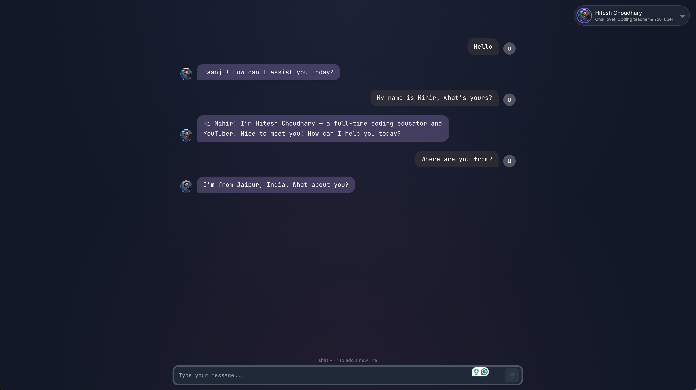
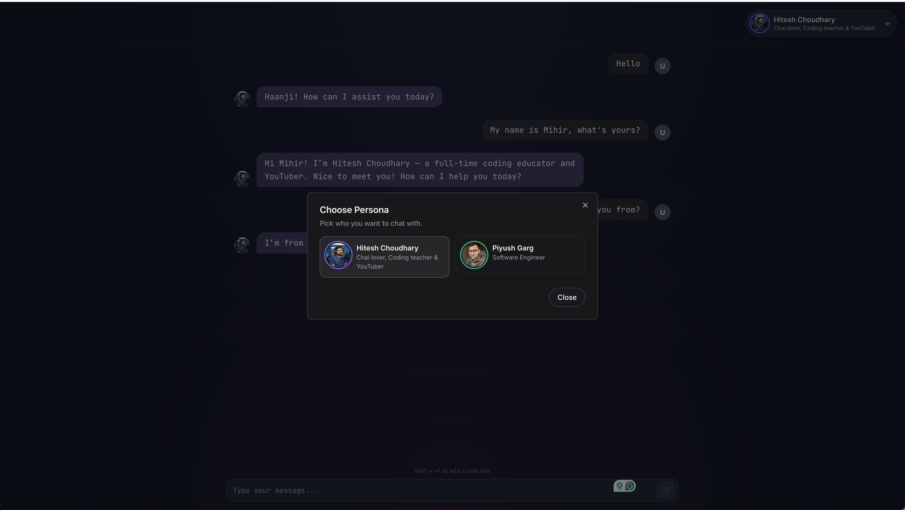
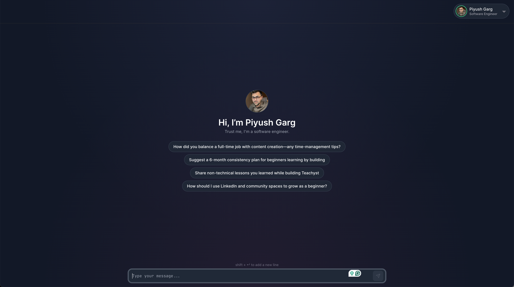

# Persona Chat App

🔗 [Live Demo](https://personas-chatbot.vercel.app/)

A Next.js-based chat application that enables conversations with AI personas, featuring real-time streaming responses and a dynamic user interface.

## Screenshots


_Main chat interface with message bubbles and persona avatar_


_Persona selection interface showing available AI characters_


_Default view_

## Features

### Core Functionality

- Real-time chat interface with AI personas
- Streaming responses with typing indicators
- Persona switching between different characters (currently Hitesh and Piyush)
- URL detection and automatic linking in messages
- Markdown formatting support
- Auto-scroll to latest messages
- Auto-scroll to latest messages

### UI/UX

- Responsive design with mobile support
- Custom avatar system with fallback initials
- Message bubbles with distinct styling for user and AI
- Persona switcher with visual feedback
- Loading states and animations
- Basic Accessibility

### Technical Features

- Built with Next.js 15 and TypeScript
- Server-side streaming using Edge Runtime
- TailwindCSS for styling
- Custom fonts (Inter, JetBrains Mono) for better readability
- OpenAI integration for chat completions

## Future Improvements

### Core Features

1. Message persistence

   - Add database integration for message history
   - Enable chat session restoration
   - Add message search functionality

2. Enhanced Interactions

   - Add support for image uploads
   - Enable code snippet formatting with syntax highlighting
   - Add voice input/output options
   - Implement message reactions

3. Persona System
   - Add persona creation interface
   - Enable custom persona uploads
   - Add persona preferences and settings
   - Implement persona conversation memory

### UI/UX Improvements

1. Accessibility

   - Add keyboard navigation
   - Improve screen reader support
   - Add high contrast mode
   - Implement reduced motion options

2. User Experience

   - Add message timestamps
   - Enable message editing/deletion
   - Add share message functionality
   - Implement conversation export

3. Visual Enhancements
   - Add light mode theme
   - Enable custom theme creation
   - Add more avatar options
   - Implement animated transitions

### Technical Improvements

1. Performance

   - Implement message virtualization
   - Add message batching
   - Optimize asset loading
   - Add service worker for offline support

2. Development

   - Add comprehensive test suite
   - Implement CI/CD pipeline
   - Add documentation generation
   - Create component storybook

3. Security
   - Add rate limiting
   - Implement message encryption
   - Add user authentication
   - Enable secure data storage

## Getting Started

First, run the development server:

```bash
npm run dev
# or
yarn dev
```

Open [http://localhost:3000](http://localhost:3000) with your browser to see the result.

## Environment Variables

Create a `.env.local` file with the following variables:

```env
OPENAI_API_KEY=your_api_key_here
```

## Tech Stack

- Next.js 14
- TypeScript
- TailwindCSS
- OpenAI
